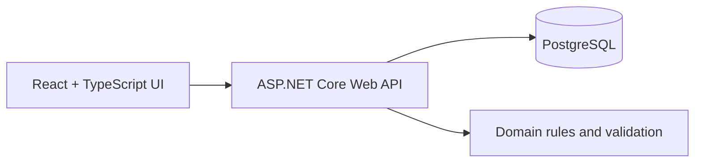
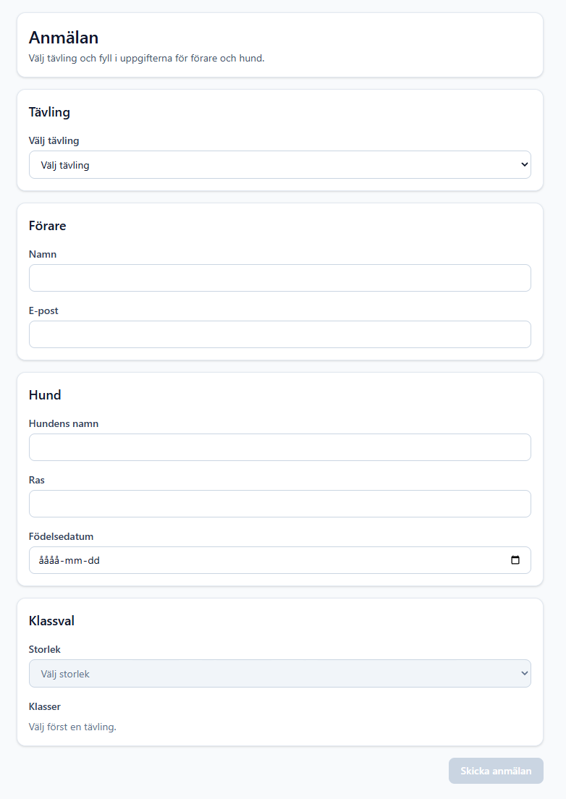
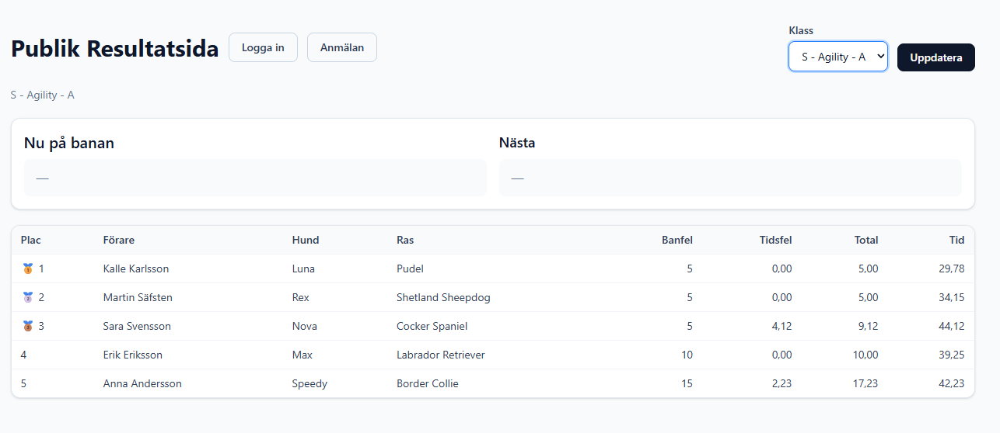
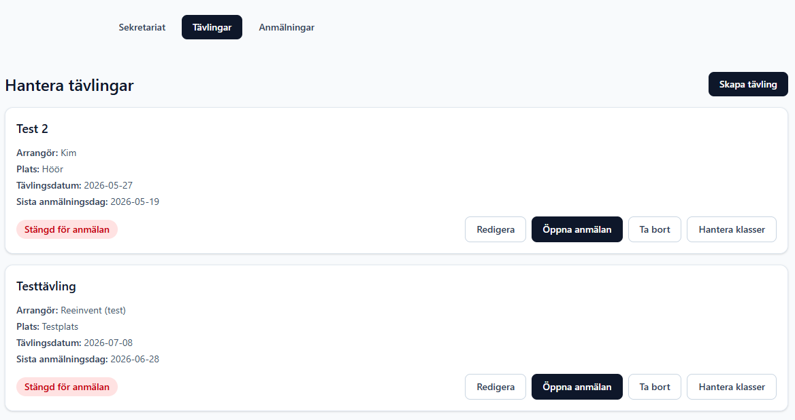
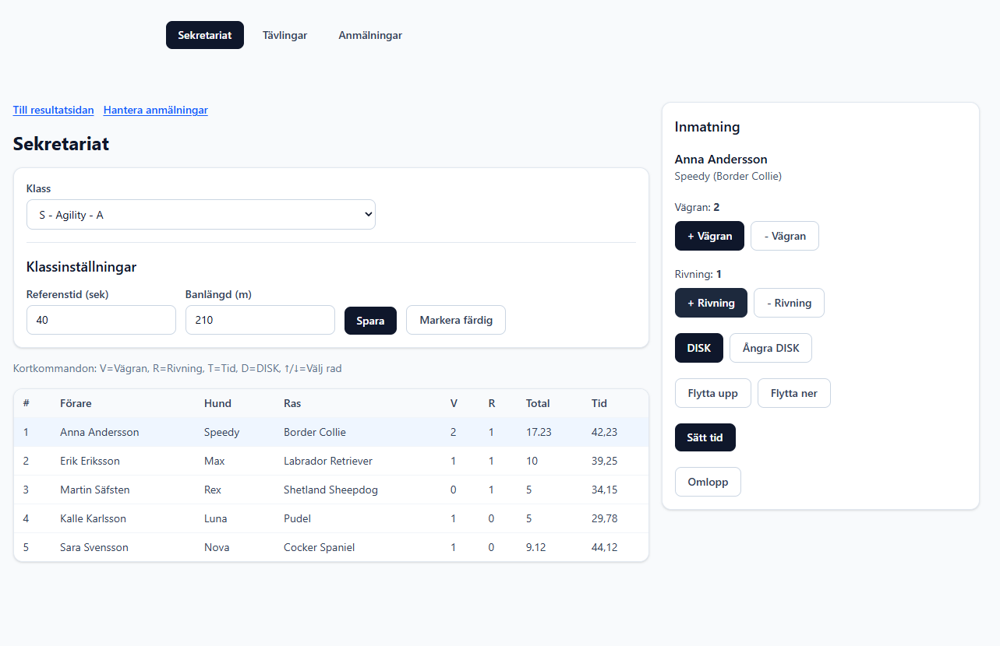

# AgilityCompetition - Portfolio

Web application for unofficial agility competitions with support for public registration/results, administration, and secretary workflows during event day.

## Live Demo
- Frontend: `https://agility-ui.vercel.app`

## Why I built this
Competition administration often relies on fragmented tools and manual workflows. This project centralizes registration, class management, start lists, and result handling in one system.

## What I built
- Public flows for registration and results
- Admin flows for competitions, class groups, and entries
- Secretary workflow for start order, runtimes, disqualifications, and reruns
- Role-based authentication and protected endpoints

## Tech Stack
- Frontend: React, TypeScript, Vite
- Backend: ASP.NET Core Web API (.NET 9), Entity Framework Core
- Database: PostgreSQL (Neon)
- Hosting: Vercel (frontend), Render (backend)

## Architecture

## Portfolio docs
- [Features](./docs/FEATURES.md)
- [Case Study](./docs/CASE_STUDY.md)
- [Technical Decisions](./docs/TECH_DECISIONS.md)
- [Code Samples](./docs/CODE_SAMPLES.md)
- [Publish Checklist](./docs/PUBLISH_CHECKLIST.md)

## Screenshots
- Public registration view 
- Public results view 
- Admin competition management 
- Secretary live workflow 

## Note on source code
This repository is a portfolio showcase. Full production source is kept private.

## Contact
- LinkedIn: `https://linkedin.com/in/kim-safsten`
- Email: `kim@safsten.se`
